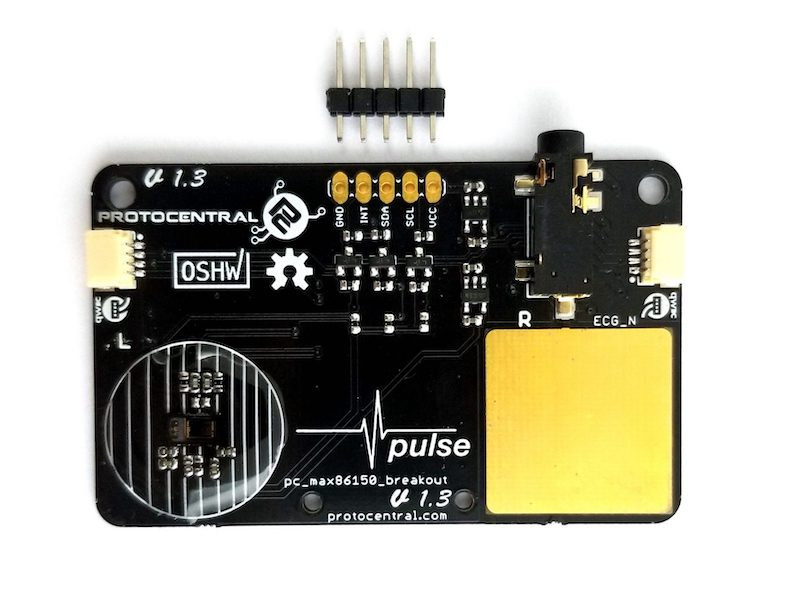
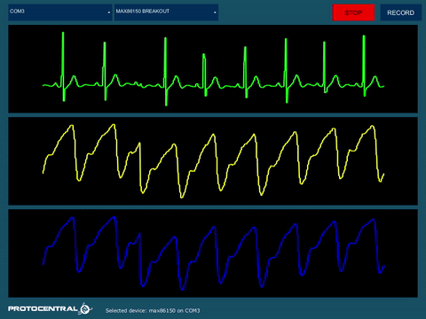

Protocentral MAX86150 PPG & ECG sensor
======================================

## Don't have one? [Buy it here](https://protocentral.com/product/protocentral-max86150-ppg-and-ecg-breakout-with-qwiic-v2/)

The MAX86150 breakout board is an all in one module that supports a trio of functions for human vitals monitoring. It integrates the Pulse oximeter (SPO2), Electrocardiogram (ECG) and Heart rate sensor module into this breakout board. In more scientific terms, it is integrated with the Photoplethysmogram and Electrocardiogram biosensor module.

What makes this breakout exceptional is that it is the only touch-based module available to detect both SPO2 as well as ECG. The breakout board allows Qwiic connect as well as breadboard mounting with the provided pins. It is designed to accommodate both the ECG touchpad and the external ECG stereo connector. However, they are configured in a way that they function in an exclusive manner when one mode is active the other remains passive. Any microcontroller such as Arduino is compatible and the communication protocol used is I2C to stream data. With all the above features, this board is best suited for any Mobile health monitoring as well as in wearable devices.

## Hardware Setup

Connection with the Arduino board is as follows:
 
 |MAX86150 pin label| Arduino Connection  |Pin Function      |
 |:-----------------: |:---------------------:|:------------------:|
 | SDA              | SDA                  |  Serial Data     |
 | SCL              | SCL                  |  Serial Clock    |
 | 5V               | 5V                  |  Power           |
 | GND              | GND                 |  GND             |
 | INT              | --                  |  Interrupt            |

## Visualizing Output

For further details of the board, refer the documentation

[ MAX86150 PPG & ECG sensor Documentation](https://docs.protocentral.com/getting-started-with-max86150/)

License Information
===================

This product is open source! Both, our hardware and software are open source and licensed under the following licenses:

Hardware
---------

**All hardware is released under the [CERN-OHL-P v2](https://ohwr.org/cern_ohl_p_v2.txt)** license.

Copyright CERN 2020.

This source describes Open Hardware and is licensed under the CERN-OHL-P v2.

You may redistribute and modify this documentation and make products
using it under the terms of the CERN-OHL-P v2 (https:/cern.ch/cern-ohl).
This documentation is distributed WITHOUT ANY EXPRESS OR IMPLIED
WARRANTY, INCLUDING OF MERCHANTABILITY, SATISFACTORY QUALITY
AND FITNESS FOR A PARTICULAR PURPOSE. Please see the CERN-OHL-P v2
for applicable conditions

Software
--------

**All software is released under the MIT License(http://opensource.org/licenses/MIT).**

THE SOFTWARE IS PROVIDED "AS IS", WITHOUT WARRANTY OF ANY KIND, EXPRESS OR IMPLIED, INCLUDING BUT NOT LIMITED TO THE WARRANTIES OF MERCHANTABILITY, FITNESS FOR A PARTICULAR PURPOSE AND NONINFRINGEMENT. IN NO EVENT SHALL THE AUTHORS OR COPYRIGHT HOLDERS BE LIABLE FOR ANY CLAIM, DAMAGES OR OTHER LIABILITY, WHETHER IN AN ACTION OF CONTRACT, TORT OR OTHERWISE, ARISING FROM, OUT OF OR IN CONNECTION WITH THE SOFTWARE OR THE USE OR OTHER DEALINGS IN THE SOFTWARE.

Documentation
-------------
**All documentation is released under [Creative Commons Share-alike 4.0 International](http://creativecommons.org/licenses/by-sa/4.0/).**

You are free to:

* Share — copy and redistribute the material in any medium or format
* Adapt — remix, transform, and build upon the material for any purpose, even commercially.
The licensor cannot revoke these freedoms as long as you follow the license terms.

Under the following terms:

* Attribution — You must give appropriate credit, provide a link to the license, and indicate if changes were made. You may do so in any reasonable manner, but not in any way that suggests the licensor endorses you or your use.
* ShareAlike — If you remix, transform, or build upon the material, you must distribute your contributions under the same license as the original.

Please check [*LICENSE.md*](LICENSE.md) for detailed license descriptions.
